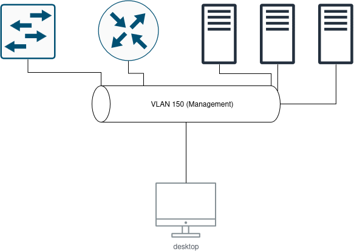

# Adressage IP du site

## Rappels
L'adresse globale de Blois est `172.28.32.0/19`  
Les VLANs disponibles sont:   
- 150  
- 260 - 269  

## VLANs
Le vlan 150 aura pour adresse réseau `10.5.150.0/24`  
  
La plage d'adresse réseau dédié aux autres VLANs `172.28.32.0/19` à `172.28.41.0/19` (le 3e octet est 32 + vlanid - 260)  
Exception: vlan 269 qui est dans un autre réseau `192.168.69.0/24`

L'adresse réseau du FAI1 est `221.87.141.0/30` et celle du FAI2 `183.44.4.0/30`

## Schéma Réseau

## Schéma du réseau de Management

