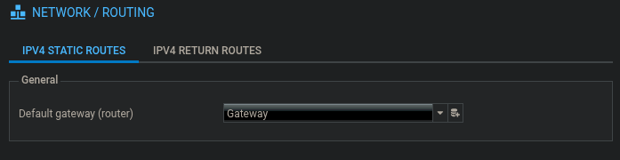
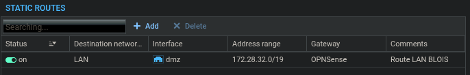
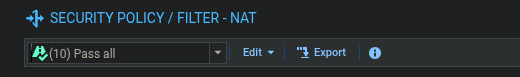
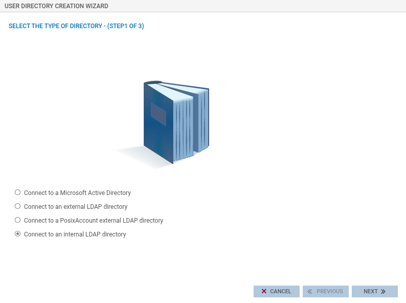
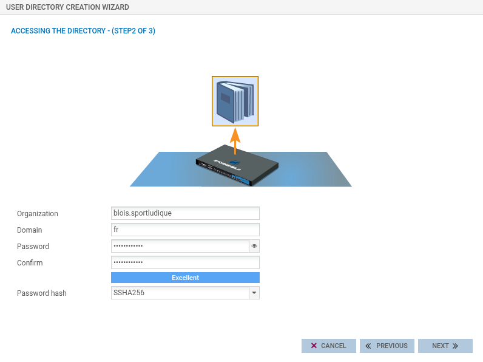
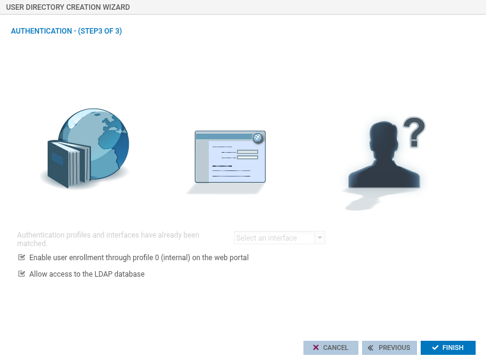
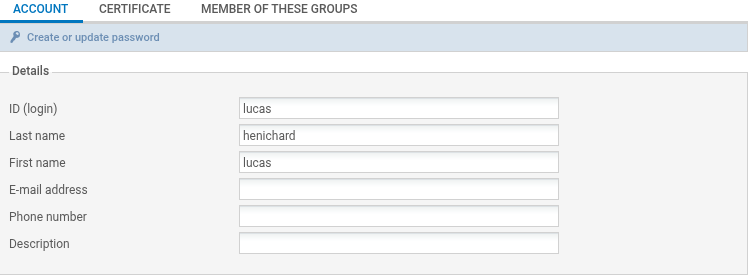
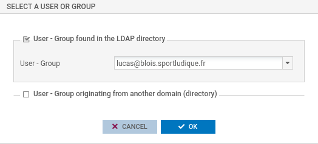

# StormShield

## Routage

### Objets nécessaires

Configuration > Objects  

#### Networks
Réseau MANA et LAN  
Add > Network > les ip des réseaux

#### Hosts
Gateway out (vers internet) et gateway in (vers la LAN)  
Add > Host > les ip des hosts

### Routes 
Il faut définir les routes vers internet (default) et vers la LAN

#### Route par défaut

Dans Configuration > Routing  

#### Route vers la LAN

## Filtrage
Configuration > Security Policy > Filter - NAT  

### Pass All  
Pour les tests, on désactive le filtrage, on mets le Pass All:  

## Création d'utilisateurs
On peut créer des users attitrés, ils n'auront par contre pas autant de permissions que admin  

### Création d'un répertoire LDAP
Dans Configuration > USERS > Directories configuration:  

### Création de l'utilisateur
Dans CONFIGURATION > USERS > Users and Groups:  
Cliquer sur Add user  

### Ajouter les perms admins

Dans CONFIGURATIONS > SYSTEM > Administrators:  
Add an administrator with all privileges  

