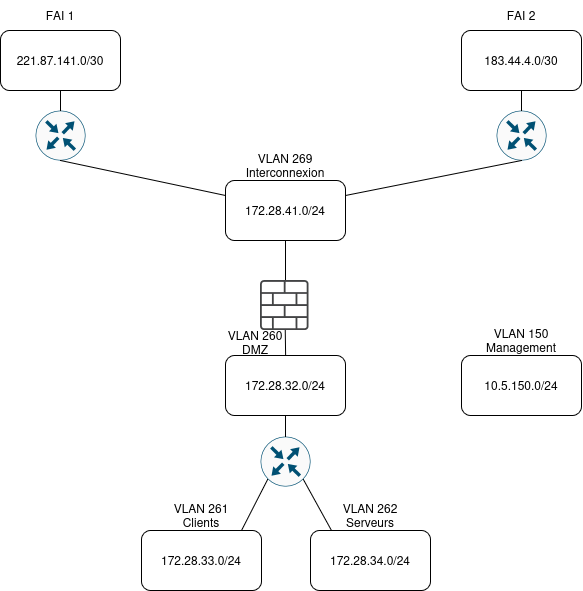

# Adressage IP du site

## Rappels
L'adresse globale de Blois est `172.28.32.0/19`
Les VLANs disponibles sont: 
- 150
- 260 - 269

## VLANs
Le vlan 150 aura pour adresse `10.5.150.0/24`

Les autres vlan auront pour les 10 autres, l'adresse seront `172.28.32.0/19` à `172.28.41.0/19` (le 3e octet est 32 + vlanid - 260)

## Schéma Réseau

